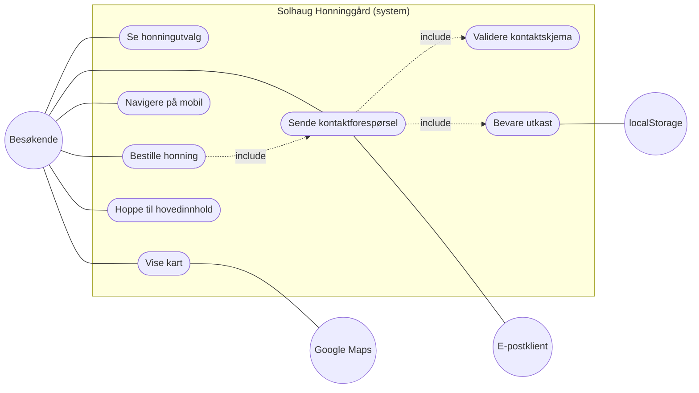

# Produktdokumentasjon — Solhaug Honninggård

> Skoleinnlevering: planlegging og videreutvikling av en app jeg har laget tidligere,
> beskrevet ved hjelp av user stories, aktører og use case.
>
> **Repo:** https://github.com/kharchenko7002/honning
> **Tech:** React + Vite + Tailwind CSS, ingen backend, ingen database.

---

## Del 1 — Hvilken app jeg har valgt

Jeg har valgt å videreutvikle nettsiden **Solhaug Honninggård** — en presentasjonsside
for et fiktivt lokalt birøkteri i Innlandet.

### Hva appen gjør i dag

- Viser frem 6 honningsorter med navn, beskrivelse, pris, bilde og smaks-label.
- Forteller historien til gården under «Om oss».
- Viser besøksinformasjon (adresse, åpningstider, kart) under «Hvor finner du oss».
- Lar besøkende sende en forespørsel via kontaktskjema som åpner brukerens
  e-postklient med ferdig utfylt emne og innhold.
- Har 5 ruter: `/`, `/honning`, `/om-oss`, `/hvor-finner-du-oss`, `/kontakt`.

### Hvem som bruker den

- **Lokale kunder** som vil bestille honning til seg selv eller som gave.
- **Turister og besøkende** som vurderer å stoppe innom gården.
- **Birøkteren selv** (innholdseier) som ønsker å presentere produktene sine
  enkelt og ryddig uten å drive en full nettbutikk.

### Hvorfor den er egnet for videreutvikling

Siden mangler bevisst alt som krever backend (handlekurv, betaling, innlogging),
men har likevel en konkret «forretningsflyt»: besøkende → produktvalg →
forespørsel. Det gir gode muligheter for å forbedre brukeropplevelse,
tilgjengelighet og robusthet uten å bygge serverlogikk.

---

## Del 2 — User stories

Mal:

```
Som <type bruker>
ønsker jeg <å gjøre noe>
slik at <jeg får en verdi / løser et problem>
```

### US1 — Vanlig bruker (lokal kunde)

> **Som** lokal kunde
> **ønsker jeg** å se alle honningsortene med pris og smaksbeskrivelse på ett sted
> **slik at** jeg kan velge riktig honning før jeg tar kontakt med gården.

### US2 — Vanlig bruker (bestilling)

> **Som** kunde som har bestemt meg for en honningsort
> **ønsker jeg** å klikke «Bestill nå» og få meldingsfeltet automatisk fylt ut
> med produktnavnet
> **slik at** jeg slipper å skrive det selv og er sikker på at gården forstår
> hvilken honning jeg vil ha.

### US3 — Ny / uerfaren bruker

> **Som** førstegangsbesøkende som aldri har hørt om Solhaug
> **ønsker jeg** en tydelig forside som raskt forklarer hva gården driver med
> **slik at** jeg forstår om dette er noe for meg uten å måtte lese hele siden.

### US4 — Bruker med spesielt behov (mobil + stresset)

> **Som** mobilbruker som leter på telefonen mens jeg er på farten
> **ønsker jeg** en mobilmeny som er enkel å åpne, lukke ved klikk utenfor eller
> Escape-tasten, og som ikke får siden bak til å rulle
> **slik at** jeg kan navigere uten å bli forvirret eller miste plassen min.

### US5 — Bruker med spesielt behov (tilgjengelighet)

> **Som** bruker som navigerer med tastatur eller skjermleser
> **ønsker jeg** å hoppe rett til hovedinnhold og ha tydelige fokusringer på alle
> interaktive elementer
> **slik at** jeg kan bruke siden uten mus og finne det jeg trenger raskt.

### US6 — Tap av data (utkast i kontaktskjema)

> **Som** besøkende som er midt i å skrive en lang melding i kontaktskjemaet
> **ønsker jeg** at innholdet bevares hvis jeg ved et uhell lukker fanen eller
> mister nettet
> **slik at** jeg slipper å skrive alt på nytt og ikke gir opp halvveis.

### US7 — Feil / sikkerhet (validering)

> **Som** besøkende som fyller ut kontaktskjemaet
> **ønsker jeg** tydelige feilmeldinger hvis jeg glemmer et felt eller skriver
> en ugyldig e-postadresse
> **slik at** jeg ikke sender en ufullstendig melding som ikke kan besvares.

---

## Del 3 — Aktører

En aktør er noe som står utenfor systemet og samhandler med det.

| # | Aktør | Type | Hva aktøren gjør |
|---|---|---|---|
| 1 | **Besøkende / kunde** | Person | Leser om gården, ser på honningsorter, sender forespørsel via kontaktskjema. |
| 2 | **Birøkter (innholdseier)** | Person | Vedlikeholder produktlisten og prisene i `src/data/honey.js`. Ikke en aktør i nettsiden under kjøring, men i utviklingsfasen. |
| 3 | **E-postklient** | Annet system | Mottar `mailto:`-lenken og åpner forhåndsutfylt melding til `post@solhaug-honning.no`. |
| 4 | **Nettleserens localStorage** | Annet system | Lagrer utkast av kontaktskjemaet lokalt mens brukeren skriver, slik at det kan gjenopprettes neste gang siden lastes. |
| 5 | **Google Maps embed** | Annet system | Viser kart over Solhaugvegen 12 via en `<iframe>` på lokasjon-siden. |

> Krav om **minst én aktør som er et annet system** er oppfylt 3 ganger
> (E-postklient, localStorage, Google Maps).

---

## Del 4 — Fra user stories til use case

Use case-navn er korte, starter med verb og beskriver én handling.

| User story | Use case |
|---|---|
| US1 — se honningutvalg | **Se honningutvalg** |
| US2 — bestille en valgt honning | **Bestille honning** |
| US4 — navigere på mobil | **Navigere på mobil** |
| US5 — bruke siden med tastatur | **Hoppe til hovedinnhold** |
| US6 — bevare utkast | **Bevare utkast** |
| US7 — få feilmeldinger | **Validere kontaktskjema** |
| (alle US om kontakt) | **Sende kontaktforespørsel** |

---

## Del 5 — Funksjonelle krav

For minst 2 use case skrives ett funksjonelt krav. Jeg skriver 3 for å vise
sammenhengen tydelig.

### FK1 — Use case: Bestille honning

> **Systemet skal** navigere brukeren til kontaktskjemaet og automatisk fylle
> inn produktnavnet i meldingsfeltet når brukeren klikker «Bestill nå» på en
> honningsort.

### FK2 — Use case: Bevare utkast

> **Systemet skal** lagre kontaktskjemaets innhold lokalt i nettleseren mens
> brukeren skriver, og gjenopprette utkastet neste gang siden lastes — så lenge
> meldingen ikke allerede er sendt. Brukeren skal også kunne slette utkastet
> med ett klikk.

### FK3 — Use case: Validere kontaktskjema

> **Systemet skal** validere at navnet er minst 2 tegn, at e-post har gyldig
> format, og at meldingen er mellom 10 og 1000 tegn. Feilmelding skal vises
> rett under det aktuelle feltet både når feltet forlates (blur) og ved forsøk
> på innsending. Innsending skal blokkeres til alle felter er gyldige.

---

## Del 6 — Use case-diagram

Diagrammet under er skrevet i [Mermaid](https://mermaid.js.org/) og rendres
automatisk på GitHub. Aktørene står utenfor systemboksen, use case står inni.



### Tekstlig forklaring av diagrammet

- **Besøkende** kobles til alle hovedhandlingene (se utvalg, bestille,
  navigere, kontakte, vise kart, hoppe til innhold).
- **Bestille honning** *inkluderer* **Sende kontaktforespørsel** — fordi
  bestilling utføres ved å sende en forhåndsutfylt forespørsel.
- **Sende kontaktforespørsel** *inkluderer* både **Validere kontaktskjema**
  (sjekke før sending) og **Bevare utkast** (lagre underveis).
- **E-postklient** mottar resultatet av kontaktforespørselen.
- **localStorage** lagrer utkastet.
- **Google Maps** leverer kart-iframen.

### ASCII-versjon (samme innhold, hvis Mermaid ikke rendres)

```
                ┌──────────────────────────────────────────────┐
                │      Solhaug Honninggård (system)            │
                │                                              │
                │   • Se honningutvalg                         │
   Besøkende ───┤   • Bestille honning ─────┐                 │
                │   • Navigere på mobil      │                 │
                │   • Hoppe til hovedinnhold │ <<include>>     │
                │   • Vise kart ─────────────│──────────────── ├─── Google Maps
                │                            ▼                 │
                │   • Sende kontaktforespørsel ─┬─────────────── ├─── E-postklient
                │       │ <<include>>           │                │
                │       ▼                       │ <<include>>    │
                │   • Validere kontaktskjema    ▼                │
                │   • Bevare utkast ─────────────────────────────├─── localStorage
                │                                              │
                └──────────────────────────────────────────────┘
```

---

## Del 7 — Hva jeg vil jobbe videre med nå

Jeg har valgt **3 use case** å fokusere på i kodefasen:

### 1. Bestille honning ✅ *ferdig*

- **Hvorfor:** Dette er den «forretningsmessige» kjernen i siden. Hvis
  bestilling ikke føles enkel, har siden mistet hele poenget.
- **Tilhørende user stories:** US1, US2.
- **Resultat:** Hele flyten er på plass — `HoneyCard` bruker `useNavigate`
  med `state: { produkt }`, og `ContactForm` plukker det opp og forhåndsfyller
  meldingen («Hei! Jeg vil gjerne bestille X. »). I tillegg har kjøp-knappen
  nå en `aria-label` som sier hvilken honning som bestilles, så skjermlesere
  ikke leser «Bestill nå» seks ganger på rad.

### 2. Validere kontaktskjema ✅ *ferdig*

- **Hvorfor:** Uten god validering blir siden frustrerende, og forespørsler
  går tapt. Dette er et tydelig case som dekker både feil, dataintegritet og
  tilgjengelighet (ARIA-koblinger).
- **Tilhørende user stories:** US6, US7.
- **Resultat:** Blur-validering, min/max-lengder, levende tegnteller, lagring
  av utkast i localStorage, «Skriv ny melding»-knapp etter sending — og en
  honeypot-felle mot bot-spam (skjult felt som bare bots fyller ut, og
  innsendinger med fylt honeypot droppes stille).

### 3. WCAG-tilgjengelighet ✅ *ferdig (første runde)*

- **Hvorfor:** Tilgjengelighet er ofte glemt i skoleprosjekter, og det er en
  konkret måte å vise omsorg for «brukere med spesielt behov».
- **Tilhørende user stories:** US5.
- **Resultat:** «Hopp til innhold»-lenke, fokus-ring globalt via
  `:focus-visible`, kontrast løftet til AA (mange `text-honey-700` byttet til
  `text-honey-900` for bedre lesbarhet), eksplisitt `width`/`height` på
  bilder for å forhindre layout shift, og aktiv side markeres nå også i
  footer-navigasjonen. Videre runder kan se på automatiske axe-tester og
  bedre skjermleser-stier.

---

## Del 8 — Egne læringsmål

Jeg vil bli bedre på 3 ting i denne perioden:

### Læringsmål 1 — Knytte plan til kode

Jeg vil forstå hvordan jeg går fra en *user story* via et *use case* og et
*funksjonelt krav* til konkret React-kode.

> Jeg vet at jeg har lært dette når jeg kan **peke på en commit i historien
> og forklare hvilken user story og hvilket use case den støtter** — og motsatt:
> peke på en user story og finne koden som dekker den.

### Læringsmål 2 — Skrive kode jeg selv kan forklare

Jeg vil at koden min skal være så enkel at jeg kan lese den linje for linje
og forklare hva hver linje gjør, uten å «lure meg selv» med komplekse løsninger.

> Jeg vet at jeg har lært dette når jeg kan **gå gjennom hele
> `ContactForm.jsx` med en medelev og forklare hver eneste hook og hver
> eneste betingelse uten å se på dokumentasjon**.

### Læringsmål 3 — Bruke KI fornuftig

Jeg vil bruke KI som en samarbeidspartner — til å forklare konsepter og
foreslå forbedringer — uten å miste kontroll over min egen kode.

> Jeg vet at jeg har lært dette når jeg kan **avvise et KI-forslag fordi jeg
> ser at det er overkomplisert eller ikke passer mitt prosjekt**, ikke bare
> akseptere alt som er foreslått.

---

## Del 9 — Arbeid med koding (logg over forbedringer)

Jeg har delt arbeidet i to faser:

### Fase 1 — Grunnleggende nettside (allerede levert)

- Vite + React + Tailwind oppsett
- Layout (Header, Footer, ruting)
- Forside med hero
- Honningside med 6 sorter
- «Om oss»
- «Hvor finner du oss» (åpningstider + kart)
- Kontaktside med skjema
- Norsk README

### Fase 2 — Skoleforbedringer (ferdig)

| # | Forbedring | Commit | User story |
|---|---|---|---|
| 1 | Mobilmeny + aktiv navigasjon: Escape lukker, klikk utenfor lukker, body-scroll låst, mer elegant aktiv-stil, «Hopp til innhold»-lenke. | `d14f5f6 feat(nav): improve mobile menu and active link styling` | US4, US5 |
| 2 | Kontaktskjema: blur-validering, min/max-lengder, levende tegnteller, lagring av utkast i localStorage, «Skriv ny melding»-knapp etter sending. | `df53204 feat(kontakt): blur-validering, tegnteller, utkast i localStorage` | US6, US7 |
| 3 | WCAG AA-kontrast: alle eyebrow-tekster og lenker byttet fra `text-honey-700` til `text-honey-900` (kontrast 9:1). Eksplisitt width/height på bilder. Tydeligere `aria-label` på «Bestill nå»-knappen. Aktiv side markeres også i footer. | `e4eb765 feat(a11y): WCAG AA-kontrast, bildedimensjoner, tydeligere ARIA-etiketter` | US5 |
| 4 | Honeypot mot bot-spam: skjult «Nettside»-felt som bare bots fyller ut. Innsendinger med fylt honeypot droppes stille uten å åpne e-postklienten. | `7d6af1c feat(kontakt): legg til honeypot mot bot-spam` | US7 |

> **Bestille honning** (US1, US2) er fullført gjennom samspillet mellom
> commit `df53204` (mottak av prefill i `ContactForm`) og commit `e4eb765`
> (tydeligere ARIA-etikett på `HoneyCard`-knappen). `useNavigate` med
> `location.state` lå allerede inne i Fase 1.

### Refleksjonsnotat (kort)

- **Hva appen gjør:** presenterer Solhaug Honninggård og lar besøkende sende
  en forespørsel — eller legge inn en bestilling for en bestemt honningsort —
  via kontaktskjema som åpner deres e-postklient.
- **Hva jeg har forbedret:** mobilmenyen er nå robust og tilgjengelig,
  kontaktskjemaet gir tydelig tilbakemelding mens man skriver, innholdet går
  ikke tapt hvis man lukker fanen, kontrasten oppfyller WCAG AA, og en enkel
  honeypot holder de mest naive bot-spammene unna.
- **Hva jeg har lært:** at planlegging med user stories gjør at hver kodeendring
  har et klart mål — og at små UX-detaljer (utkastlagring, fokusringer,
  Escape-tast, eksplisitte bildedimensjoner) oppleves som «omsorg» av brukeren
  selv om de er enkle å lage. Jeg har også lært at tilgjengelighet ikke trenger
  å være vanskelig: 9 av 10 forbedringer er små klasse- eller attributt-endringer.

---

## KI-logg

Enkel logg over hvor jeg har brukt KI (Claude Code) som samarbeidspartner.

### Spørsmål 1 — Mobilmeny

- **Spurte om:** «Hvordan kan jeg gjøre den mobile navigasjonen bedre å bruke
  uten å bytte UI-bibliotek?»
- **Fikk hjelp til:** å legge på Escape-lukking, klikk-utenfor (backdrop),
  body-scroll-lock, og en mer elegant aktiv-stil med understrek/aksentstrek
  istedenfor heldekkende fargefyll. Tok også med en «Hopp til innhold»-lenke.
- **Lærte:** at små tilgjengelighets-grep (Escape, fokushåndtering, skip-link)
  er enkle å sette på når komponenten allerede er ryddig — og hvorfor `useEffect`
  trenger en cleanup-funksjon når den endrer noe globalt (her: `body.style.overflow`).

### Spørsmål 2 — Validering av kontaktskjema

- **Spurte om:** «Hvordan kan jeg validere skjemaet mens brukeren skriver,
  uten å mase med feilmeldinger før de har rørt feltet?»
- **Fikk hjelp til:** å skille mellom *touched* og *untouched* felt — bare
  kjøre validering live etter at feltet har vært forlatt en gang, og kjøre
  full validering ved submit.
- **Lærte:** mønsteret med separate `touched`- og `errors`-states er en ren
  måte å implementere «vennlig validering» på, og `aria-describedby` kan peke
  til flere id-er samtidig (hjelpetekst + feilmelding + tegnteller).

### Spørsmål 3 — Lagre utkast i nettleseren

- **Spurte om:** «Hvordan kan jeg sørge for at brukeren ikke mister teksten
  sin hvis de lukker fanen ved et uhell — uten å bygge en backend?»
- **Fikk hjelp til:** å bruke `localStorage` med try/catch (for privat-modus
  og kvotefeil), og å skille mellom «det finnes et utkast» og «vi viste at vi
  gjenopprettet det» — slik at jeg kan vise en egen banner med en
  «Slett utkast»-knapp.
- **Lærte:** at `localStorage` er overraskende lett å bruke for skjema-utkast,
  men at man bør pakke alt i try/catch fordi nettleseren kan kaste feil
  (privatmodus, full lagring), og at det er viktig å rydde opp etter
  vellykket innsending.

### Spørsmål 4 — Tilgjengelighet og kontrast

- **Spurte om:** «Hvilke konkrete grep kan jeg ta for å oppfylle WCAG AA på
  denne siden uten å bytte hele fargepaletten?»
- **Fikk hjelp til:** å regne ut faktisk kontrastforhold for de mest brukte
  fargekombinasjonene (`text-honey-700` på hvit ga 3.7:1 — fail for liten
  tekst). Byttet systematisk til `text-honey-900` for å nå ~9:1, og la til
  `width`/`height` på alle bildene for å unngå layout shift på treg forbindelse.
- **Lærte:** at AA-kravet er annerledes for «large bold» (≥18pt fet) tekst
  enn for vanlig brødtekst — og at små attributt-endringer (`width`/`height`,
  `aria-label`, `tabIndex`) ofte gir større tilgjengelighetsgevinst enn store
  refaktoreringer.

### Spørsmål 5 — Honeypot mot bot-spam

- **Spurte om:** «Hvordan kan jeg holde bots unna kontaktskjemaet uten en
  CAPTCHA og uten en backend?»
- **Fikk hjelp til:** å sette inn et skjult «Nettside»-felt (honeypot) som er
  flyttet utenfor synsfeltet med `left: -9999px`, har `aria-hidden="true"`,
  `tabIndex={-1}` og `autoComplete="off"`. Hvis feltet er fylt ut ved
  innsending, later vi som om alt gikk bra — men åpner ikke e-postklienten.
- **Lærte:** at honeypot er den enkleste anti-spam-mekanismen man kan ha,
  men at det krever omhu for at ekte brukere (særlig de som bruker
  skjermlesere) ikke blir lurt med — derfor `aria-hidden`, `tabIndex={-1}` og
  en forklarende `label` om at feltet skal stå tomt.

### Hvordan jeg passet på å forstå koden

- Jeg leste hver linje før jeg committet og sjekket at jeg kunne forklare den
  med egne ord.
- Hvis et forslag fra KI brukte en hook eller et mønster jeg ikke kjente,
  spurte jeg om en kort forklaring først, og så vurderte jeg om det var verdt
  kompleksiteten.
- Jeg avviste forslag som krevde nye biblioteker (f.eks. `react-hook-form`,
  `framer-motion`) — siden CLAUDE.md sier at prosjektet skal være enkelt nok
  til at læreren kan lese hver linje.

---

## Levering — sjekkliste

- [x] Kode som kan kjøres (GitHub-repo: <https://github.com/kharchenko7002/honning>)
- [x] User stories (≥ 5, med vanlig + ny + spesielt behov + feil/sikkerhet/tap)
- [x] Aktører (≥ 3, minst én er et annet system)
- [x] Use case (3–5)
- [x] Funksjonelle krav (≥ 2)
- [x] Use case-diagram (Mermaid + ASCII)
- [x] Refleksjonsnotat
- [x] Enkel KI-logg
- [ ] Visning til lærer (4–5 min) — gjøres på leveringsdagen.
